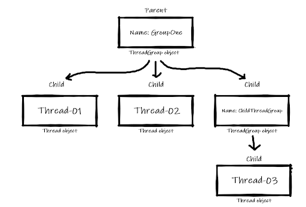

# Thread Grouping

We can group some threads so that we can sleep, wait or terminate with a single method. A ThreadGroup represents a set of threads. A thread group can also include the other thread group. The thread group creates a tree in which every thread group except the initial thread group has a parent.

A thread is allowed to access information about its own thread group, but it cannot access the information about its parent thread group or any other thread groups. We will discuss this in a later lecture. How can we make a group of threads? We need to use a class called `ThreadGroup`.

Instantiating a `ThreadGroup` class, we can make a `ThreadGroup` object. This object acts like a container which can store threads as well as other `ThreadGroup` objects. Every `ThreadGroup` object must have a name which is given at the time of instantiation. 

##### *Thread Hierarchy- ( This is implemented at the end of the pdf )*



For Example:

``` java
class Main{
   public static void main(String[] args) {
       // ThreadGroup object created using a constructor
       ThreadGroup threadGroup = new ThreadGroup("GroupOne");
   }
}
```

We can create a `ThreadGroup` object using this constructor -

``` java
public ThreadGroup(String name)
```

Note that this is not the default constructor. The `ThreadGroup` class has a default constructor and that is private. So, we cannot use this.

``` java
private ThreadGroup()
```

We can create as many thread groups as we want. For example -

``` java
class Main{
   public static void main(String[] args) {
       ThreadGroup tG1 = new ThreadGroup("G1");
       ThreadGroup tG2 = new ThreadGroup("G2");
       ThreadGroup tG3 = new ThreadGroup("G3");
       ThreadGroup tG4 = new ThreadGroup("G3");
       // We can create even more
   }
}
```

**The ThreadGroup class does not have any static public variables or methods. Also, this class does not have any non-static public instance variable. **Now, how can we add a thread in a thread group? Analyze the following code -

``` java
class Main{
   public static void main(String[] args) {
       // Thread group : TG1
       ThreadGroup tG1 = new ThreadGroup("G1");
      
       // Adding a thread to tg1
       Thread t1 = new Thread(tG1, "TaskOne"){
           @Override
           public void run() {
               // Thread code goes here
           }
       };
      
       // Adding another thread to tg1
       Thread t2 = new Thread(tG1, "TaskTwo"){
           @Override
           public void run() {
               // Thread code goes here
           }
       };
   }
}
```

Thread t1 and t2 are now added to the ThreadGroup object tG1. We are using a new constructor of thread class, which is -

``` java
public Thread(ThreadGroup group, String name)
```

This constructor takes a ThreadGroup object and a name and creates a Thread object grouped with the given ThreadGroup object. **We cannot add a thread after instantiation of the thread.** For Example -

``` java
class Main{
   public static void main(String[] args) {
       // Thread group : TG1
       ThreadGroup tG1 = new ThreadGroup("G1");

       // Adding a thread to tg1
       Thread t1 = new Thread("TaskOne"){
           @Override
           public void run() {
               // Thread code goes here
           }
       };
      
       // There is no way of adding t1 into tg1 at this moment
   }
}
```

So, the only way of adding a thread in a thread group is to pass the `ThreadGroup` object during instantiation. More example:

*While extending a Thread class:*

``` java
class TaskOne extends Thread{
   public TaskOne(ThreadGroup group, String name) {
       super(group, name);
   }

   @Override
   public void run() {
       for (int i = 0; i < 10; i++) {
           System.out.println(i);
       }
   }
}

class Main{
   public static void main(String[] args) {
       ThreadGroup tg = new ThreadGroup("MyThreadGroup");
       TaskOne t = new TaskOne(tg, "Thread-1");
   }
}
```

We need to override the constructor that can receive a ThreadGroup object.

*While implementing the Runnable interface:*

``` java
class TaskOne implements Runnable{
   @Override
   public void run() {
       for (int i = 0; i < 10; i++) {
           System.out.println(i);
       }
   }
}

class Main{
   public static void main(String[] args) {
       ThreadGroup tg = new ThreadGroup("MyThreadGroup");
       TaskOne taskOne = new TaskOne();
       // New type of constructors which receives
       // a ThreadGroup object and a Runnable object
       Thread t1 = new Thread(tg, taskOne);

       // New type of constructors which receives
       // a ThreadGroup object, Runnable object and
       // also the name of the thread
       Thread t2 = new Thread(tg, taskOne, "Thread-1");
   }
}
```

Here are 2 new constructors that are used in the above code -

``` java
public Thread(ThreadGroup group, Runnable target)
public Thread(ThreadGroup group, Runnable target, String name)
```

These 2 constructor are used while implementing the Runnable class. They both receive a ThreadGroup object and a Runnable object. But the later one also receives a name for the thread.

So, we have seen a few more constructor of Thread class -

| Constructor                                                  | Description                                                  |
| ------------------------------------------------------------ | ------------------------------------------------------------ |
| `public Thread(ThreadGroup group, String name)`              | Receives a ThreadGroup object and a name for creating a new thread |
| `public Thread(ThreadGroup group, Runnable target)`          | Receives a ThreadGroup object and a Runnable object for creating a new thread |
| `public Thread(ThreadGroup group, Runnable target, String name)` | Allocates a new Thread object so that it has target as its run object, has the specified name as its name, and belongs to the thread group referred to by group. |

Another Example:

``` java
class TaskOne implements Runnable{
   @Override
   public void run() {
       // Task 1 code
   }
}

class TaskTwo extends Thread{
   public TaskTwo(ThreadGroup group, String name) {
       super(group, name);
   }

   @Override
   public void run() {
       // Task 2 code
   }
}

class Main{
   public static void main(String[] args) {
       ThreadGroup tg = new ThreadGroup("MyThreadGroup");

       // Adding a thread method 1 (Runnable class)
       Thread t1 = new Thread(tg, new TaskOne(), "Thread-1");

       // Adding a thread method 2 (Thread class)
       TaskTwo t2 = new TaskTwo(tg, "Thread-2");

       // Adding a thread method 3 (no class)
       Thread t3 = new Thread(tg, "Thread-3"){
           @Override
           public void run() {
               // Thread code
           }
       };
   }
}
```

In the above code, all 3 methods of adding a thread in a thread group are shown.

---

Now, how to add a ThreadGroup object in another thread group? The ThreadGroup class actually has 2 constructors and **every ThreadGroup object has a parent group.**

``` java
public ThreadGroup(String name)
public ThreadGroup(ThreadGroup parent, String name)
```

The first one we used before. With the second one we can add a ThreadGroup object in a thread group.

``` java
class Main{
   public static void main(String[] args) {
       // Creating a Thread Group
       ThreadGroup tg1 = new ThreadGroup("MyThreadGroupOne");
       // Creating a Thread Group which is added to tg1 group
       ThreadGroup tg2 = new ThreadGroup(tg1,"MyThreadGroupTwo");
   }
}
```

**Here, the first thread group object (`tg1`) has the current running thread as its parent (main thread).**

---

Remember the hierarchy we have seen earlier? Let’s implement that:

``` java
import java.io.File;
import java.io.FileWriter;
import java.io.IOException;

class TaskOne implements Runnable{
   // TaskOne prints 0 to 9 in console
   @Override
   public void run() {
       // Prints 0 to 9
       for (int i = 0; i < 10; i++) {
           System.out.println(i);
       }
   }
}

class TaskTwo extends Thread{
   // TaskTwo creates a file and writes "Hello World" in the file
   public TaskTwo(ThreadGroup group, String name) {
       super(group, name);
   }

   @Override
   public void run() {
       try {
           print();
       } catch (IOException e) {
           e.printStackTrace();
       }
   }

   void print() throws IOException {
       File file = new File("test.txt");
       FileWriter writer = new FileWriter(file);
       writer.write("Hello World");
       writer.close();
   }
}

class Main{
   public static void main(String[] args) {
       // Parent ThreadGroup
       ThreadGroup tg1 = new ThreadGroup("GroupOne");
       // Adding a thread to parent group (Thread-01)
       Thread t1 = new Thread(new TaskOne(), "Thread-01");
       // Adding another thread to parent group (Thread-02)
       TaskTwo t2 = new TaskTwo(tg1, "Thread-02");
       // Adding another thread group to parent group (ChildThreadGroup)
       ThreadGroup tg2 = new ThreadGroup(tg1, "ChildThreadGroup");
       // Adding a thread to tg2 which is a child group of parent tg1
       // and parent to the thread (Thread-03) which added in the
       // following line
       Thread t3 = new Thread(tg2, "Thread-03"){
           @Override
           public void run() {
               System.out.println("Hello World");
           }
       };
   }
}
```

The above code has 3 threads:

- `Thread-01`
- `Thread-02`
- `Thread-03`

And two thread groups:

- `GroupOne`
- `ChildThreadGroup`

`GroupOne` has 2 child threads, `Thread-01` and `Thread-02`, and a child group, `ChildThreadGroup`. `ChildThreadGroup` has one child thread, `Thread-03`. `GroupOne` has the main thread as its parent.

----

### Non-static methods of ThreadGroup class

There are many non-static methods in the ThreadGroup class. First we will see the getter-setter methods-

| Non-Static method                           | Description                                                  |
| ------------------------------------------- | ------------------------------------------------------------ |
| `public final String getName()`             | Returns the name of this thread group.                       |
| `public final int getMaxPriority()`         | Returns the maximum priority of this thread group. Threads that are part of this group cannot have a higher priority than the maximum priority. |
| `public final void setMaxPriority(int pri)` | Sets the maximum priority of the group. Threads in the thread group that already have a higher priority are not affected. |
| `public final ThreadGroup getParent()`      | Returns the parent of this thread group.                     |

**`public final String getName ()`**

This method returns the name of the ThreadGroup object.

``` java
class Main{
   public static void main(String[] args) {
       ThreadGroup tg1 = new ThreadGroup("GroupOne");
       System.out.println(tg1.getName());
   }
}
```

Output:

``` shell
$ java Main.java
GroupOne
```

****

**`public final int getMaxPriority()`**

This method returns the maximum priority a child can have of a group. The default maximum priority is 10.

``` java
class Main{
   public static void main(String[] args) {
       ThreadGroup tg1 = new ThreadGroup("GroupOne");
       System.out.println(tg1.getMaxPriority());
   }
}
```

Output:

``` shell
$ java Main.java
10
```

***

**`public final void setMaxPriority(int pri)`**

This method returns the maximum priority a child can have of a group. The default maximum priority is 10.

``` java
class Main{
   public static void main(String[] args) {
       ThreadGroup tg1 = new ThreadGroup("GroupOne");
       tg1.setMaxPriority(3);
       System.out.println(tg1.getMaxPriority());
   }
}
```

Output:

``` shell
$ java Main.java
3
```

***

**`public final ThreadGroup getParent()`**

This method returns the parent thread group of a ThreadGroup object.

``` java
class Main{
   public static void main(String[] args) {
       // Parent - main
       ThreadGroup tg1 = new ThreadGroup("GroupOne");
       System.out.println(tg1.getParent());
       // Parent - GroupOne
       ThreadGroup tg2 = new ThreadGroup(tg1,"GroupTwo");
       System.out.println(tg2.getParent());
   }
}
```

Output:

``` shell
$ java Main.java
java.lang.ThreadGroup[name=main,maxpri=10]
java.lang.ThreadGroup[name=GroupOne,maxpri=10]
```

***

Now, we will see more non-static methods of `ThreadGroup` class

| Non-Static method                              | Description                                                  |
| ---------------------------------------------- | ------------------------------------------------------------ |
| `public int activeCount()`                     | Returns an estimate of the number of active threads in this thread group and its subgroups. Recursively iterates over all subgroups in this thread group. |
| `public int activeGroupCount()`                | Returns an estimate of the number of active groups in this thread group and its subgroups. Recursively iterates over all subgroups in this thread group. |
| `public final void interrupt()`                | Interrupts all threads in this thread group.                 |
| `public void list()`                           | Prints information about this thread group to the standard output. This method is useful only for debugging. |
| `public final boolean parentOf(ThreadGroup g)` | Tests if this thread group is either the thread group argument or one of its ancestor thread groups. |

***

**`public int activeCount()`**

This method returns the number of active threads in a ThreadGroup.

``` java
class MyTask implements Runnable{
   @Override
   public void run() {
      
   }
}

class Main{
   public static void main(String[] args) {
       // Parent - main
       ThreadGroup tg1 = new ThreadGroup("GroupOne");
       Thread t1 = new Thread(tg1, new MyTask());
       Thread t2 = new Thread(tg1, new MyTask());
       Thread t3 = new Thread(tg1, new MyTask());
       // this will print 0, because no thread is running
       System.out.println(tg1.activeCount());

       t1.start();
       // this will print 1, because one thread is running
       System.out.println(tg1.activeCount());

       t2.start();
       t3.start();
       // this will print 3, because all threads are running
       System.out.println(tg1.activeCount());
   }
}
```

Output:

``` shell
$ java Main.java
0
1
3
```

---

**`public intactiveGroupCount()`**

This method returns the number of groups in a thread group. We don’t have to start any threads for counting. 

``` java
class Main{
   public static void main(String[] args) {
       // Parent - main
       ThreadGroup tg1 = new ThreadGroup("GroupOne");
       ThreadGroup tg2 = new ThreadGroup(tg1,"GroupTwo");
       ThreadGroup tg3 = new ThreadGroup(tg1,"GroupThree");
       // Prints 2 on screen. For printing group count it does not
       // matter if any thread is started.
       System.out.println(tg1.activeGroupCount());
   }
}
```

Output:

``` shell
$ java Main.java
2
```

---

**`public final voidinterrupt()`**

This method interrupts the current running thread group by interrupting all of the threads in the group. **Skip this method for now… we will discuss this as needed.**

---

**`public void list()`**

This method prints the thread tree of the current thread group. Only use it when debugging.

``` java
class Main{
   public static void main(String[] args) {
       ThreadGroup tg1 = new ThreadGroup("GroupOne");
       ThreadGroup tg2 = new ThreadGroup(tg1,"GroupTwo");
       ThreadGroup tg3 = new ThreadGroup(tg2,"GroupThree");
       ThreadGroup tg4 = new ThreadGroup(tg1,"GroupThree");
       // prints the hierarchy
       tg1.list();
   }
}
```

Output:

``` shell
$ java Main.java
java.lang.ThreadGroup[name=GroupOne,maxpri=10]
    java.lang.ThreadGroup[name=GroupTwo,maxpri=10]
        java.lang.ThreadGroup[name=GroupThree,maxpri=10]
    java.lang.ThreadGroup[name=GroupThree,maxpri=10]
```

---

**`public final boolean parentOf(ThreadGroup g)`**

This method returns true/false if a thread group is the parent of another thread group.

``` java
class Main{
   public static void main(String[] args) {
       ThreadGroup tg1 = new ThreadGroup("GroupOne");
       ThreadGroup tg2 = new ThreadGroup(tg1,"GroupTwo");

       System.out.println(tg1.parentOf(tg2));  // returns true
       System.out.println(tg2.parentOf(tg1));  // returns false
   }
}
```

Output:

``` shell
$ java Main.java
true
false
```

---
