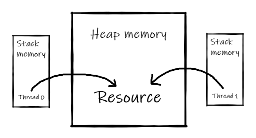

# Memory Allocation in Thread

Every thread needs space to do its own task. There are 2 types of memory in every program. One is Heap memory, and the other one is Stack memory.

Heap memory is shared by every thread of the program. Heap memory is like a common room where everyone can use an asset/facility. On the other hand every thread has its own stack memory which can only be accessed by that thread (Think of it as a personal locker).



All local variables of primitive types ( `boolean`, `byte`, `short`, `char`, `int`, `long`, `float`, `double`) are fully stored on the thread stack and are thus not visible to other threads. One thread may pass a copy of a primitive variable to another thread, but it cannot share the primitive local variable itself.

The heap contains all objects created in your Java application, regardless of what thread created the object. This includes the object versions of the primitive types. It does not matter if an object was created and assigned to a local variable, or created as a member variable of another object, the object is still stored on the heap.


So, every thread has a thread stack and that’s the memory that only THAT thread can access. Also there is Heap memory which is shared to all the threads.

Sometimes, we need to share resources between two threads or among all the threads. For this, we store that resource in the heap memory so that it can be shared. Suppose we want to do a file operation using 2 threads. Now if we put the file in the heap, both of the threads can access that file and do the operations. But if we do not put the file in the heap, it will be stored in the stack and there is no way 2 threads can work on that file because the other thread will not have access to the threads’ stack in which the file is stored.

Now, local variables are stored in the thread stack, that means each thread has its own copy of the local variable. In contrast, when multiple threads are working with the same object, they share that object so they don’t have their own copy. So in a shared object, if one thread changes the value of the object's instance variable, the other threads will see the new value from that point forward.

Example:

``` java
class TaskOne implements Runnable{
   @Override
   public void run() {
       for (int i = 0; i < 10; i++) {
           System.out.println(Thread.currentThread().getName() + ": " + i);
       }
   }
}

class Main{
   public static void main(String[] args) {
       Thread t1 = new Thread(new TaskOne());
       Thread t2 = new Thread(new TaskOne());
       t1.start();
       t2.start();
   }
}
```

In this code, for each thread a new instance is created which is two `new TaskOne()`.

```java
Thread t1 = new Thread(new TaskOne());
Thread t2 = new Thread(new TaskOne());
```

For `t1` and `t2`, the object of `TaskOne()` is different. So there are two copies of the `TaskOne()`, both of them are in the stack of thread `t1` and `t2`.

Output:

``` shell
$ java Main.java
Thread-1: 0
Thread-1: 1
Thread-0: 0
Thread-0: 1
Thread-0: 2
Thread-0: 3
Thread-0: 4
Thread-1: 2
Thread-0: 5
Thread-0: 6
Thread-0: 7
Thread-0: 8
Thread-0: 9
Thread-1: 3
Thread-1: 4
Thread-1: 5
Thread-1: 6
Thread-1: 7
Thread-1: 8
Thread-1: 9
```

Now, let's keep an object into heap memory and let the other threads share that object.

``` java
class Count{
   public int count = 0;
   void increment(){
       for (count = 0; count < 10; count++) {
           System.out.println(Thread.currentThread().getName() +": " + count);
       }
   }
}

class TaskOne implements Runnable{
   public Count C;

   public TaskOne(Count c) {
       this.C = c;
   }

   @Override
   public void run() {
       C.increment();
   }
}


class Main{
   public static void main(String[] args) {
       Count c = new Count();
       // passing the same object "c"
       Thread t1 = new Thread(new TaskOne(c));
       Thread t2 = new Thread(new TaskOne(c));
       t1.start();
       t2.start();
   }
}
```

In this code, the Count class has a variable and a method `increment()`. The point of making this class is we want to share one instance of this class to both of the threads. The threads which are created from the TaskOne class, receive a Count object and work on that object so it doesn’t matter how many threads we are creating. We will always pass one object to all of the threads.

The output will be :

```shell
$ java Main.java
Thread-0: 0
Thread-0: 1
Thread-1: 0
Thread-0: 2
Thread-1: 3
Thread-0: 4
Thread-1: 5
Thread-0: 6
Thread-1: 7
Thread-0: 8
Thread-1: 9
```

Pay attention to this output. In the previous output, each thread printed 10 times. In total, 20 lines were printed on the console. But in the later one, we are seeing 11 lines of total output. 

This is because both of the threads share the same variable and run the `C.increment()`  method at the same time. Scheduler decides which thread will be executed first and the first thread that runs on the processor executes the first iteration of the for loop. Then whichever thread comes executes the second iteration of the loop and so on.

**We can see 0 is being printed twice because of the buffering issue. We will discuss it in the next lesson.**

