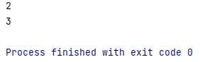

# Fields and methods of Thread class

Thread class implements the `Runnable` class which has a `run()` method.

```java
public class Thread implements Runnable{ ... }
```

The `Runnable` interface is -

``` java
public interface Runnable {
     public abstract void run();
}
```

So, whenever we instantiate a Thread class, we need to implement this run method in order to work.

#### Priority in Threads -

There are priorities in threads. Each thread has its own priority which is denoted by an integer where 1 is the lowest value and 10 being the highest. When we create a thread it always gets a default priority which is 5. Even the main thread gets default priority.

- **Lowest priority is defined as `MIN_PRIORITY`  in Thread class which has value 1.**

- **Default priority is defined as `NORM_PRIORITY` in Thread class which has value 5.**

- **Highest priority is defined as `MAX_PRIORITY` in Thread class which has value 10.**

Thread Class has 3 **`public static`** instance variables -

| `public static` instance variable       | Value |
| --------------------------------------- | ----- |
| `public static final int MIN_PRIORITY`  | 1     |
| `public static final int NORM_PRIORITY` | 5     |
| `public static final int MAX_PRIORITY`  | 10    |

Again, Thread Class has various **`public static`** methods -

| **`public static`** method                                   | Description                                                  |
| ------------------------------------------------------------ | ------------------------------------------------------------ |
| ```public static native void sleep(long millis) throws InterruptedException``` | Causes the currently running thread to block for at least the specified number of milliseconds. |
| `public static native Thread currentThread()`                | Returns a reference to the currently running thread, which is the thread that invokes this method. |
| `public static void dumpStack()`                             | Prints the stack trace for the currently running thread, which is useful when debugging a multithreaded application. |
| `public static int activeCount()`                            | Returns an estimate of the number of active threads in the current thread's thread group and its subgroups. |
| `public static boolean interrupted()`                        | Tests whether the current thread has been interrupted. The interrupted status of the thread is cleared by this method |

Let’s see the usage of the above mention static methods - 

- **`public static int activeCount()`**
  This method simply returns an integer, which is an estimate of the number of active threads in the current program at the calling point. For example -

  ``` java
  class Main {
     public static void main(String[] args) {
         System.out.println(Thread.activeCount());
         // new thread created
         new Thread(){
             @Override
             public void run() {
                 super.run();
             }
         }.start();
        
         System.out.println(Thread.activeCount());
     }
  }
  ```

  In this program, before creating the thread, there was only one thread in the program which is the main thread. After creating the thread, we will have in total 2 threads. So the output would look like this:

  ```shell
  $ java Main.java
  1
  2
  ```

  Now, let’s see the output of the above program when this tutorial was written-

  Here we can see, the first call of `activeCount()`, it returned 2. Then in the second call, it returned 3. What just happened?

  

  Java has a garbage collector, we know that. That garbage collector runs another thread behind the scenes. GC (Garbage Collector) doesn't usually run always. In fact, we really don’t know when it will run. It runs as it needs to. So, there are actually 2 threads even though we don’t create a new thread, one is the main itself and the other is GC. However, if the code is run in debug mode, GC won’t be run. At that time it will return 1 and 2, as we previously expected.

- **`public static native Thread currentThread()`**

  Returns a reference to the currently executing thread object. We can store that thread object. 

  ```java
  class Main {
     public static void main(String[] args) {
         Thread t = Thread.currentThread();
         System.out.println(t);
     }
  }
  ```

  Here, we are storing the current running thread object into t .Now this t can be used as needed. Printing this `Thread.currentThread()` will print some description of the current thread. The output of the above code :

  ```shell
  $ java Main.java
  Thread[main,5,main]
  ```

  Here the syntax is -`Thread[thread_name, priority, namespace]`

  Here the `thread_name` is main, which is given by the JVM. We can change this. The `priority` is 5 because every thread has priority 5 by default. Also, we can change this. The `namespace` is main. Again :

  ``` java
  class Main {
     public static void main(String[] args) {
         Thread thread = new Thread(){
             @Override
             public void run() {
                 System.out.println(Thread.currentThread());
             }
         };
         thread.start();
         // main thread
         System.out.println(Thread.currentThread());
     }
  }
  ```

  Output :

  ```shell
  $ java Main.java
  Thread[main,5,main]
  Thread[Thread-0,5,main]
  ```

  So, calling `Thread.currentThread()` and printing will always print the current threads’ description.

- **`public static boolean interrupted()`**

  A thread can be interrupted for various reasons. This method just returns a `boolean` to indicate if a thread is being interrupted or not. **More on this later. Skip this part at the moment.**

  ``` java
  class Main {
     public static void main(String[] args) {
         Thread t = Thread.currentThread();
         System.out.println(Thread.interrupted());
         t.interrupt();
         System.out.println(Thread.interrupted());
     }
  }
  ```

  In this code, before calling `interrupt()`, it prints `false`. Then after being interrupted, it will display `true`.

  ```shell
  $ java Main.java
  false
  true
  ```

  

- **`public static void dumpStack()`**

  This will print the stack trace of the current thread, just like in exception stack trace `e.printStackTrace()`.

  ``` java
  class Main {
     public static void main(String[] args) {
         Thread.dumpStack();
     }
  }
  ```

  Output:

  ```shell
  $ java Main.java
  java.lang.Exception: Stack trace
  	at java.base/java.lang.Thread.dumpStack(Thread.java:1377)
  	at Main.main(Person.java:3)
  ```

  
  
  
  
- **`public static native void sleep(long millis) throws InterruptedException`**
  This is an important method in threading. With this method, we can slow down a thread process/pause a thread process for some time.

  This method takes a parameter which is of `long` type. This is the time in milliseconds. If we pass 1000 in this method, the thread will pause for 1 second. Again if we pass 5000, it will pause for 5 seconds. As this method throws an `InterruptedException`, we need to catch that Exception. For that we need a try-catch block.

  ```java
  class Main {
     public static void main(String[] args) {
         for (int i = 0; i < 10; i++) {
             try {
                 Thread.sleep(1000);
             } catch (InterruptedException e) {
                 e.printStackTrace();
             }
             System.out.println(i);
         }
     }
  }
  ```

  This code will print 0 to 9 but not at once. After starting execution, it will pause for a second then print 0. Again it will pause for a second and print 1 and so on. So, if we run this code, we can see that each instruction is happening step-by-step. 

  Another Example :

  ``` java
  class Main {
     public static void main(String[] args) {
         // First Thread
         new Thread() {
             @Override
             public void run() {
                 for (int i = 0; i < 5; i++) {
                     try {
                         Thread.sleep(5000);
                     } catch (InterruptedException e) {
                         e.printStackTrace();
                     }
                     System.out.println("From Thread 1:\t" + i);
                 }
             }
         }.start();
        
         // Second Thread
         new Thread() {
             @Override
             public void run() {
                 for (int i = 4; i >=0; i--) {
                     try {
                         Thread.sleep(3000);
                     } catch (InterruptedException e) {
                         e.printStackTrace();
                     }
                     System.out.println("From Thread 2:\t" + i);
                 }
             }
         }.start();
     }
  }
  ```

  In this code there are 2 threads. One will print from 0 to 4 another will print from 4 to 0. First thread will sleep 5 second in each iteration and Second one will sleep 3 second. 
  So, even though we started the first thread first, we will see output from the second thread first. Then we will see output from the first thread, immediately followed by the second thread output.

  Output:

  ```shell
  $ java Main.java
  From Thread 2:    4
  From Thread 1:    0
  From Thread 2:    3
  ...
  ...
  ```

  Here we can actually identify which output will show first and which is second. This is because one thread is taking 5 second sleep and the other one is taking 3 seconds. Let’s calculate the output and match with the right side compiled output.

  Compiled Output:

  ```Shell
  $ java Main.java
  1. From Thread 2: 4
  2. From Thread 1: 0
  3. From Thread 2: 3
  4. From Thread 2: 2
  5. From Thread 1: 1
  6. From Thread 2: 1
  7. From Thread 1: 2
  8. From Thread 2: 0
  9. From Thread 1: 3
  10. From Thread 1: 4
  ```

  Calculated Output:

  | First Thread        | Second Thread |
  | ------------------- | ------------- |
  | sleep               | sleep         |
  | sleep               | sleep         |
  | sleep               | sleep         |
  | sleep               | 4             |
  | sleep               | sleep         |
  | 0                   | sleep         |
  | sleep               | sleep         |
  | sleep               | 3             |
  | sleep               | sleep         |
  | sleep               | sleep         |
  | sleep               | sleep         |
  | **1**               | **2**         |
  | sleep               | sleep         |
  | sleep               | sleep         |
  | sleep               | sleep         |
  | sleep               | 1             |
  | sleep               | sleep         |
  | 2                   | sleep         |
  | sleep               | sleep         |
  | sleep               | 0             |
  | Continues Execution | End of thread |

  Here, in the bold box, the first and the second thread will execute at the same time, we cannot be able to tell who will come first in this case. It will depend on the scheduler and the OS to decide. Even if we can calculate what will be the next output, it might not match with the compiled output. So, the calculation of thread is not always accurate. Try with 0-10.

